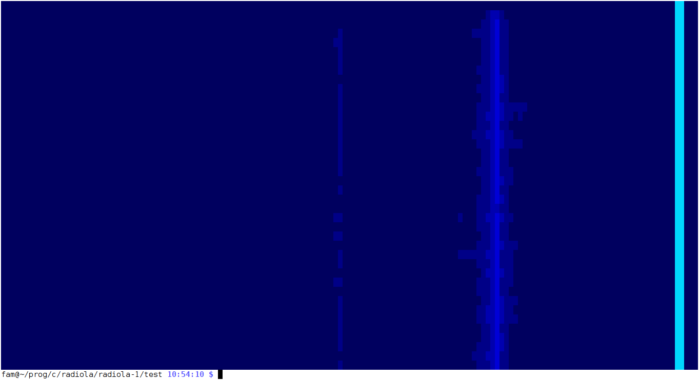
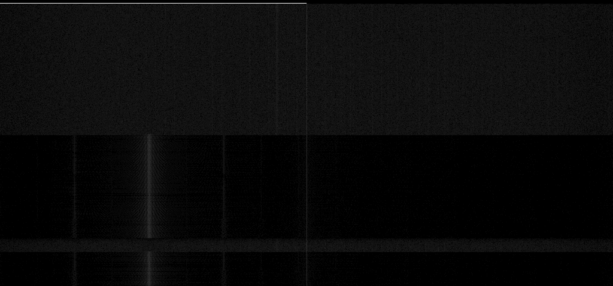

# Radiola

rtlsdr based sdr software, early prototype

basic support for terminal waterfall,  
basic support for graphical waterfall,  
basic support for fm demodulation (ready to listen fm station)  

## terminal waterfall

## graphical waterfall

